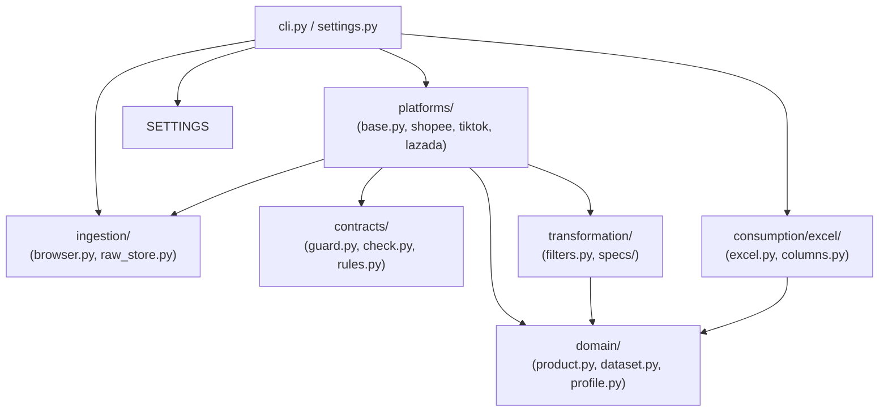

# File Dependency Specification (15-Minute Technical Review)

This document maps out module dependencies and provides a concise file-by-file lookup table.

---

## 1. System Dependency Graph (Mermaid)

---

## 2. File-by-File Reference Matrix

| File Path | Core Purpose | Applied Design Pattern / Note |
|---|---|---|
| `src/ecommerce/cli.py` | Command-line orchestrator for all pipeline operations. | **Facade Pattern** |
| `src/ecommerce/settings.py` | Strongly typed Pydantic configuration loader (`configs/*.yaml`). | **Strongly Typed Config** |
| `src/ecommerce/ingestion/browser.py` | Attaches to Chrome/Edge via Patchright and intercepts XHR JSON API responses. | **Network Interceptor** |
| `src/ecommerce/ingestion/raw_store.py` | Immutable Bronze storage writer (`data/raw/<platform>/<run_id>/`). | **Immutable Append-Only Log** |
| `src/ecommerce/ingestion/images.py` | Downloads, resizes, and caches product thumbnails for Excel embedding. | **Cache Layer** |
| `src/ecommerce/contracts/guard.py` | Real-time schema drift monitor; halts crawling if API keys change. | **Circuit Breaker** |
| `src/ecommerce/contracts/check.py` | Compares current raw runs against versioned baseline schemas. | **Regression Guard** |
| `src/ecommerce/domain/product.py` | Canonical Pydantic data model (`Product`, `Variant`, `Shop`, `Price`, `Stock`). | **Canonical Model (CDM)** |
| `src/ecommerce/domain/dataset.py` | Aggregate container holding products, excluded candidates, errors, and metadata. | **Aggregate Root** |
| `src/ecommerce/domain/profile.py` | Loads category filtering keywords and attribute vocabularies (`configs/domains/`). | **Domain Knowledge Base** |
| `src/ecommerce/platforms/base.py` | Abstract Base Class `PlatformAdapter` and `@register_platform` decorator. | **Adapter & Registry Pattern** |
| `src/ecommerce/platforms/common/helpers.py` | Shared dict/list casting, number conversion (`to_int`, `to_float`), and navigation (`dig`). | **Shared Utility Helper** |
| `src/ecommerce/platforms/shopee/` | Shopee edge adapter (`extract/` listing/details/sku, `parse/` raw JSON to `Product`). | Platform Edge Adapter |
| `src/ecommerce/platforms/tiktok/` | TikTok Shop edge adapter (`extract/` keyword pages, `parse/` HTML-embedded JSON). | Platform Edge Adapter |
| `src/ecommerce/platforms/lazada/` | Lazada edge adapter (`extract/` AJAX search, `parse/` `__moduleData__` JSON). | Platform Edge Adapter |
| `src/ecommerce/transformation/filters.py` | Rule-based domain category filters (keeps relevant items, drops off-category). | **Data Cleansing Engine** |
| `src/ecommerce/transformation/specs/` | Regex extractors for product attributes (capacity, material, size, origin, warranty). | **Feature Extractor** |
| `src/ecommerce/consumption/excel/excel.py` | Excel report generation engine reading layout YAMLs and outputting formatted `.xlsx`. | **Builder Pattern** |
| `src/ecommerce/consumption/excel/columns.py` | Registry for computing and formatting column values per row/SKU. | **Column Registry** |
