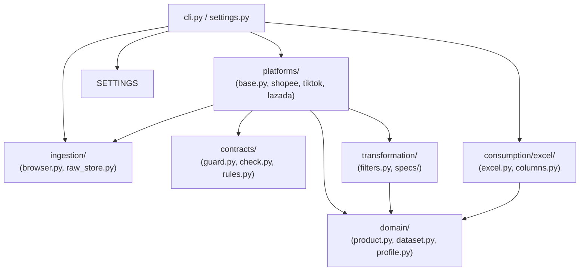

# File Dependency Specification (15-Minute Technical Review)

This document maps out module dependencies and provides a concise file-by-file lookup table.

---

## 1. System Dependency Graph (Mermaid)



---

## 2. File-by-File Reference Matrix

| File Path | Core Purpose | Applied Design Pattern / Note |
|---|---|---|
| `src/ecommerce/cli.py` | Command-line orchestrator for all pipeline operations. | **Facade Pattern** |
| `src/ecommerce/settings.py` | Strongly typed Pydantic configuration loader (`configs/*.yaml`). | **Strongly Typed Config** |
| `src/ecommerce/ingestion/browser.py` | Attaches to Chrome/Edge via Patchright and intercepts XHR JSON API responses. | **Network Interceptor** |
| `src/ecommerce/ingestion/raw_store.py` | Immutable Bronze storage writer (`data/raw/<platform>/<run_id>/`). | **Immutable Append-Only Log** |
| `src/ecommerce/ingestion/images.py` | Downloads, resizes, and caches product thumbnails for Excel embedding. | **Cache Layer** |
| `src/ecommerce/contracts/guard.py` | Real-time schema drift monitor; halts crawling if API keys change. | **Circuit Breaker** |
| `src/ecommerce/contracts/check.py` | Compares current raw runs against versioned baseline schemas. | **Regression Guard** |
| `src/ecommerce/domain/product.py` | Canonical Pydantic data model (`Product`, `Variant`, `Shop`, `Price`, `Stock`). | **Canonical Model (CDM)** |
| `src/ecommerce/domain/dataset.py` | Aggregate container holding products, excluded candidates, errors, and metadata. | **Aggregate Root** |
| `src/ecommerce/domain/profile.py` | Loads category filtering keywords and attribute vocabularies (`configs/domains/`). | **Domain Knowledge Base** |
| `src/ecommerce/platforms/base.py` | Abstract Base Class `PlatformAdapter` and `@register_platform` decorator. | **Adapter & Registry Pattern** |
| `src/ecommerce/platforms/common/helpers.py` | Shared dict/list casting, number conversion (`to_int`, `to_float`), and navigation (`dig`). | **Shared Utility Helper** |
| `src/ecommerce/platforms/shopee/` | Shopee edge adapter (`extract/` listing/details/sku, `parse/` raw JSON to `Product`). | Platform Edge Adapter |
| `src/ecommerce/platforms/tiktok/` | TikTok Shop edge adapter (`extract/` keyword pages, `parse/` HTML-embedded JSON). | Platform Edge Adapter |
| `src/ecommerce/platforms/lazada/` | Lazada edge adapter (`extract/` AJAX search, `parse/` `__moduleData__` JSON). | Platform Edge Adapter |
| `src/ecommerce/transformation/filters.py` | Rule-based domain category filters (keeps relevant items, drops off-category). | **Data Cleansing Engine** |
| `src/ecommerce/transformation/specs/` | Regex extractors for product attributes (capacity, material, size, origin, warranty). | **Feature Extractor** |
| `src/ecommerce/consumption/excel/excel.py` | Excel report generation engine reading layout YAMLs and outputting formatted `.xlsx`. | **Builder Pattern** |
| `src/ecommerce/consumption/excel/columns.py` | Registry for computing and formatting column values per row/SKU. | **Column Registry** |
=======
# SƠ ĐỒ PHỤ THUỘC & BẢO CÁO REVIEW SOURCE CODE (FILE DEPENDENCY & CODE REVIEW SPECIFICATION)

> **Công ty / Dự án**: Enterprise E-Commerce Data Platform
> **Tác giả**: Jules - Senior Data Code Reviewer / Data Architect
> **Mục tiêu**: Giúp Technical Lead, Data Engineer và Reviewer hiểu toàn bộ nguồn mã nguồn trong **5 phút** qua sơ đồ phụ thuộc file (File Dependency Graph), luồng dữ liệu (Data Flow) và chú thích chi tiết vai trò từng file code.

---

## 1. TỔNG QUAN KIẾN TRÚC TRONG 5 PHÚT (EXECUTIVE SUMMARY)

Hệ thống được thiết kế theo triết lý kiến trúc Data Engineering hiện đại:
> **"Platform-specific at the edge, unified at the core, independent at consumption."**
> *(Xử lý riêng biệt tại biên - Thống nhất ở lõi - Độc lập khi tiêu thụ dữ liệu)*

### 💡 Luồng Dữ Liệu 3 Tầng (Bronze -> Silver -> Gold Architecture)

```
 [1. CLI / User Request]
           │
           ▼
 [2. Ingestion (Bronze)]  ──► Browser (Chrome Attach Mode) ──► Raw JSON Store (data/raw/<platform>/<run>/)
           │                                                        │ (Lưu trữ bất biến, có thể Replay)
           ▼                                                        │
 [3. Data Quality / Guard] ◄────────────────────────────────────────┘ (Giám sát drift schema khi crawl)
           │
           ▼
 [4. Platform Adapter]    ──► Raw Parsers (Shopee/TikTok/Lazada) ──► Unified Product Domain Model
           │                                                                    │
           ▼                                                                    ▼
 [5. Transformation]      ──► Domain Filters (Lọc ngành) + Spec Extractors (Tách thuộc tính regex)
           │                                                                    │
           ▼                                                                    ▼
 [6. Consumption (Gold)]  ──► Excel Report Writer (Layout YAML) ──► Final Export (.xlsx với ảnh nhúng)
```

---

## 2. SƠ ĐỒ PHỤ THUỘC GIỮA CÁC FILE CODE (FILE DEPENDENCY DIAGRAM)

Dưới đây là sơ đồ phụ thuộc (Dependency Graph) chi tiết bằng **Mermaid**. Mũi tên `A --> B` thể hiện file `A` import hoặc gọi hàm/class từ file `B`.

```mermaid
graph TD

    %% --------------------------------------------------
    %% LAYER 1: CLI & CONFIG
    %% --------------------------------------------------
    subgraph L1["1. Entrypoint & Config"]
        CLI["src/ecommerce/cli.py"]
        SETTINGS["src/ecommerce/settings.py"]
    end

    %% --------------------------------------------------
    %% LAYER 2: INGESTION & RAW STORE (BRONZE)
    %% --------------------------------------------------
    subgraph L2["2. Ingestion Layer (Bronze)"]
        BROWSER["src/ecommerce/ingestion/browser.py"]
        RAW_STORE["src/ecommerce/ingestion/raw_store.py"]
        IMAGES["src/ecommerce/ingestion/images.py"]
    end

    %% --------------------------------------------------
    %% LAYER 3: CONTRACTS & DATA QUALITY
    %% --------------------------------------------------
    subgraph L3["3. Contracts & Schema Guard Layer"]
        GUARD["src/ecommerce/contracts/guard.py"]
        RULES["src/ecommerce/contracts/rules.py"]
        CHECK["src/ecommerce/contracts/check.py"]
        CONTRACT_SH["src/ecommerce/contracts/shopee.py"]
        CONTRACT_TT["src/ecommerce/contracts/tiktok.py"]
        CONTRACT_LZ["src/ecommerce/contracts/lazada.py"]
    end

    %% --------------------------------------------------
    %% LAYER 4: DOMAIN MODEL (CANONICAL CORE)
    %% --------------------------------------------------
    subgraph L4["4. Domain Core Layer"]
        PROD_MODEL["src/ecommerce/domain/product.py"]
        CAND_MODEL["src/ecommerce/domain/candidate.py"]
        DATASET["src/ecommerce/domain/dataset.py"]
        PROFILE["src/ecommerce/domain/profile.py"]
    end

    %% --------------------------------------------------
    %% LAYER 5: PLATFORM ADAPTERS (EDGE)
    %% --------------------------------------------------
    subgraph L5["5. Platform Edge Adapters Layer"]
        PLAT_BASE["src/ecommerce/platforms/base.py"]
        PLAT_REG["src/ecommerce/platforms/__init__.py"]

        subgraph Shopee["Shopee Edge"]
            SH_ADAPTER["platforms/shopee/adapter.py"]
            SH_EXTRACT["platforms/shopee/extract/*"]
            SH_PARSE["platforms/shopee/parse/*"]
        end

        subgraph TikTok["TikTok Edge"]
            TT_ADAPTER["platforms/tiktok/adapter.py"]
            TT_EXTRACT["platforms/tiktok/extract/*"]
            TT_PARSE["platforms/tiktok/parse/*"]
        end

        subgraph Lazada["Lazada Edge"]
            LZ_ADAPTER["platforms/lazada/adapter.py"]
            LZ_EXTRACT["platforms/lazada/extract/*"]
            LZ_PARSE["platforms/lazada/parse/*"]
        end
    end

    %% --------------------------------------------------
    %% LAYER 6: TRANSFORMATION (SILVER)
    %% --------------------------------------------------
    subgraph L6["6. Transformation Layer (Silver)"]
        FILTERS["src/ecommerce/transformation/filters.py"]
        SPECS["src/ecommerce/transformation/specs/*"]
    end

    %% --------------------------------------------------
    %% LAYER 7: CONSUMPTION (GOLD / PRESENTATION)
    %% --------------------------------------------------
    subgraph L7["7. Consumption Layer (Gold)"]
        EXCEL_WRITER["src/ecommerce/consumption/excel/excel.py"]
        EXCEL_COLS["src/ecommerce/consumption/excel/columns.py"]
        EXCEL_LAYOUT["src/ecommerce/consumption/excel/layout.py"]
        EXCEL_CHECK["src/ecommerce/consumption/excel/checklist.py"]
    end

    %% ==================================================
    %% DEPENDENCY CONNECTIONS
    %% ==================================================

    %% CLI Dependencies
    CLI --> SETTINGS
    CLI --> PLAT_REG
    CLI --> RAW_STORE
    CLI --> CHECK
    CLI --> EXCEL_WRITER
    CLI --> PROFILE

    %% Settings Dependencies
    SETTINGS --> PROFILE

    %% Ingestion Dependencies
    SH_EXTRACT --> BROWSER
    TT_EXTRACT --> BROWSER
    LZ_EXTRACT --> BROWSER

    SH_EXTRACT --> RAW_STORE
    TT_EXTRACT --> RAW_STORE
    LZ_EXTRACT --> RAW_STORE

    SH_EXTRACT --> GUARD
    TT_EXTRACT --> GUARD
    LZ_EXTRACT --> GUARD

    %% Contracts Dependencies
    GUARD --> RULES
    CHECK --> RULES
    CHECK --> RAW_STORE
    CONTRACT_SH --> RULES
    CONTRACT_TT --> RULES
    CONTRACT_LZ --> RULES

    %% Platform Core Dependencies
    PLAT_REG --> PLAT_BASE
    PLAT_REG --> SH_ADAPTER
    PLAT_REG --> TT_ADAPTER
    PLAT_REG --> LZ_ADAPTER

    SH_ADAPTER --> PLAT_BASE
    SH_ADAPTER --> SH_EXTRACT
    SH_ADAPTER --> SH_PARSE

    TT_ADAPTER --> PLAT_BASE
    TT_ADAPTER --> TT_EXTRACT
    TT_ADAPTER --> TT_PARSE

    LZ_ADAPTER --> PLAT_BASE
    LZ_ADAPTER --> LZ_EXTRACT
    LZ_ADAPTER --> LZ_PARSE

    %% Parsers -> Domain & Transformation
    SH_PARSE --> PROD_MODEL
    SH_PARSE --> DATASET
    SH_PARSE --> FILTERS
    SH_PARSE --> SPECS

    TT_PARSE --> PROD_MODEL
    TT_PARSE --> DATASET
    TT_PARSE --> FILTERS
    TT_PARSE --> SPECS

    LZ_PARSE --> PROD_MODEL
    LZ_PARSE --> DATASET
    LZ_PARSE --> FILTERS
    LZ_PARSE --> SPECS

    %% Transformation Dependencies
    FILTERS --> PROFILE
    FILTERS --> PROD_MODEL
    SPECS --> PROFILE
    SPECS --> PROD_MODEL

    %% Consumption Dependencies
    EXCEL_WRITER --> EXCEL_COLS
    EXCEL_WRITER --> EXCEL_LAYOUT
    EXCEL_WRITER --> EXCEL_CHECK
    EXCEL_WRITER --> IMAGES
    EXCEL_WRITER --> DATASET
    EXCEL_COLS --> PROD_MODEL
```



---

## 3. CHÚ THÍCH & PHÂN TÍCH VAI TRÒ TỪNG FILE CODE (FILE-BY-FILE ANNOTATIONS)

### 3.1. Core & Config Layer (`src/ecommerce/`)

| File Code | Vai trò & Trách nhiệm chính | Input / Output | Design Pattern / Ghi chú |
|---|---|---|---|
| `cli.py` | Command-line interface chính. Tiếp nhận các lệnh (`crawl`, `export`, `probe`, `login`, `status`, `check-schema`, `inspect`) và điều phối toàn bộ workflow. | **Input**: Tham số CLI (`--platform`, `--keyword`, `--domain`...)<br>**Output**: Kích hoạt Crawl / Export / Status | **Facade Pattern**: Cung cấp giao diện duy nhất cho người dùng điều khiển hệ thống. |
| `settings.py` | Nơi định nghĩa cấu hình hệ thống bằng Pydantic model (`AppConfig`, `PlatformConfig`, `CrawlRequest`). Nạp các file YAML cấu hình trong `configs/`. | **Input**: File YAML (`app.yaml`, `platforms/*.yaml`) + CLI override<br>**Output**: Objects cấu hình có type hint & validation | **Strongly Typed Config**: Đảm bảo không lỗi typo biến môi trường hay file cấu hình. |
| `__main__.py` | Entry point cho module Python (`python -m ecommerce`). | Gọi `cli.main()` | N/A |

---

### 3.2. Ingestion & Raw Layer - Bronze (`src/ecommerce/ingestion/`)

| File Code | Vai trò & Trách nhiệm chính | Input / Output | Design Pattern / Ghi chú |
|---|---|---|---|
| `browser.py` | Điều khiển trình duyệt thật (Chrome/Edge) qua Patchright/Playwright ở chế độ **Attach Mode**. Lắng nghe network responses (XHR/Fetch), phát hiện Captcha/Block page và tạm dừng chờ người dùng giải quyết. | **Input**: URL, Network CDP events<br>**Output**: Trả về Response JSON Payload / Page HTML | **CDP Response Interceptor**: Bắt dữ liệu JSON trực tiếp từ XHR API thay vì parse HTML CSS selector. |
| `raw_store.py` | Lớp lưu trữ dữ liệu thô (Bronze Layer Store). Tạo thư mục chạy (`data/raw/<platform>/<run_id>/`), lưu file JSON bất biến cho danh sách tìm kiếm (`search/`), trang chi tiết (`items/`), `candidates.json`, `failures.json`, `run.json`. | **Input**: JSON payload thô từ API trình duyệt<br>**Output**: Các file `.json` được ghi nguyên bản (Atomic Write) | **Immutable Append-Only Log**: Dữ liệu thô lưu vĩnh viễn làm checkpoint và dùng cho replay export. |
| `images.py` | Tải xuống hình ảnh sản phẩm / SKU, thực hiện resize/thumbnail và cache trên đĩa để chèn vào file Excel báo cáo. | **Input**: Image URL<br>**Output**: File ảnh `.png`/`.jpg` local hoặc PIL Image object | **Cache Layer**: Tránh tải lại cùng một hình ảnh nhiều lần. |

---

### 3.3. Contracts & Data Quality Layer (`src/ecommerce/contracts/`)

| File Code | Vai trò & Trách nhiệm chính | Input / Output | Design Pattern / Ghi chú |
|---|---|---|---|
| `guard.py` | Lớp bảo vệ Schema Drift thời gian thực trong quá trình crawl. Nếu phát hiện N sản phẩm liên tiếp thiếu trường dữ liệu cốt lõi, nó tự động dừng lượt crawl để tránh hỏng dữ liệu. | **Input**: Item JSON từ trình duyệt<br>**Output**: Raiser `SchemaDriftError` hoặc ghi log cảnh báo | **Circuit Breaker Pattern**: Ngắt crawl ngay khi phát hiện sàn TMĐT thay đổi API. |
| `rules.py` | Định nghĩa các quy tắc kiểm tra tính hợp lệ của trường JSON (bắt buộc tồn tại, dạng dữ liệu, giá trị không rỗng). | **Input**: JSON dict & Rule spec<br>**Output**: Danh sách vi phạm schema (if any) | **Specification Pattern** |
| `check.py` | Lệnh `ecommerce check-schema`: so sánh các file thô trong lượt crawl hiện tại với file Baseline chuẩn (`baselines/*.json`) để phát hiện trường nào bị đổi tên hoặc mất đi. | **Input**: Run ID, Baseline JSON<br>**Output**: Báo cáo Schema Diff & coverage % | **Regression Guard** |
| `snapshot.py` | Trích xuất khung xương (keys tree) từ JSON ngẫu nhiên để hỗ trợ cập nhật baseline. | **Input**: File JSON thô<br>**Output**: Baseline schema template | Utility |
| `paths.py` | Quản lý đường dẫn tới các file baseline JSON của các sàn. | Đường dẫn file local | Configuration |
| `shopee.py` | Tập hợp các quy tắc Schema Contract riêng cho API Shopee (`search_items`, `pdp/get_pc`). | JSON Rules Spec | Platform Rule Spec |
| `tiktok.py` | Quy tắc Schema Contract riêng cho TikTok Shop (`__MODERN_ROUTER_DATA__`, product API). | JSON Rules Spec | Platform Rule Spec |
| `lazada.py` | Quy tắc Schema Contract riêng cho Lazada (`window.__moduleData__`). | JSON Rules Spec | Platform Rule Spec |

---

### 3.4. Domain Core Layer - Canonical Models (`src/ecommerce/domain/`)

| File Code | Vai trò & Trách nhiệm chính | Input / Output | Design Pattern / Ghi chú |
|---|---|---|---|
| `product.py` | Model chuẩn hóa trung tâm (Canonical Data Model) bằng Pydantic (`Product`, `Variant`, `Shop`, `Price`, `Rating`, `Sales`, `Stock`). Đảm bảo dữ liệu từ mọi sàn đều được đưa về cùng 1 cấu trúc thống nhất. | **Input**: Parsed attributes<br>**Output**: Validated Entity Object | **Canonical Data Model (CDM)**: Giúp phần tiêu thụ dữ liệu (Excel/BI) không phụ thuộc vào sàn. |
| `candidate.py` | Model chứa thông tin ứng viên sản phẩm phát hiện từ trang tìm kiếm (`Candidate`), đánh dấu lý do giữ lại hoặc loại bỏ. | **Input**: Item ID, Title, Price, Rank<br>**Output**: Candidate Model | Value Object |
| `dataset.py` | Container đại diện cho toàn bộ kết quả của 1 lượt crawl (`Dataset`), gồm danh sách `Product`, danh sách bị loại, lỗi crawl và metadata. | **Input**: List of Products, Candidates, Failures<br>**Output**: Combined Dataset Object | **Aggregate Root Pattern** |
| `profile.py` | Nạp và quản lý Profile domain (`configs/domains/<domain>.yaml` - ví dụ `giu_nhiet.yaml`). Chứa danh sách từ khóa giữ/loại, từ vựng thuộc tính (chất liệu, dung tích...). | **Input**: YAML Profile file<br>**Output**: DomainProfile Object | Domain Knowledge Holder |

---

### 3.5. Platform Edge Adapters Layer (`src/ecommerce/platforms/`)

#### 🔹 Framework chung (`src/ecommerce/platforms/`)

| File Code | Vai trò & Trách nhiệm chính | Input / Output | Design Pattern / Ghi chú |
|---|---|---|---|
| `base.py` | Abstract Base Class `PlatformAdapter` định nghĩa giao diện bắt buộc cho mọi sàn: `crawl()`, `build_dataset()`, `check_session()`. | Interface class | **Adapter Pattern / Strategy Pattern** |
| `__init__.py` | Registry đăng ký các adapter (`get_adapter("shopee")`, `list_platforms()`). | String platform name -> Adapter instance | **Factory / Registry Pattern** |

#### 🔹 Platform Shopee (`src/ecommerce/platforms/shopee/`)
- `adapter.py`: Lớp triển khai `ShopeeAdapter` kết nối các bước crawl và parse cho Shopee.
- `extract/listing.py`: Crawl trang tìm kiếm/danh mục Shopee -> ghi nhận Candidate.
- `extract/detail.py`: Crawl chi tiết từng trang sản phẩm Shopee -> lưu JSON thô.
- `extract/sku_stock.py`: Tương tác click từng biến thể sản phẩm (Variant) để đọc tồn kho thực tế từng SKU.
- `extract/session.py`: Kiểm tra trạng thái đăng nhập Shopee.
- `parse/dataset.py` & `parse/*.py`: Chuyển đổi toàn bộ JSON thô Shopee thành `Product` canonical domain model (`product.py`, `price.py`, `variants.py`, `stock.py`, `rating.py`, `shop.py`, `sales.py`, `content.py`).

#### 🔹 Platform TikTok Shop (`src/ecommerce/platforms/tiktok/`)
- `adapter.py`: Lớp triển khai `TikTokAdapter`.
- `extract/crawl.py` & `fetch.py`: Đọc các trang từ khóa `/vn/k/<slug>` & Related Searches (do TikTok không có ô tìm kiếm/sắp xếp chuẩn).
- `parse/*.py`: Bóc tách JSON nhúng trong HTML (`__MODERN_ROUTER_DATA__`) chuyển thành `Product` model.

#### 🔹 Platform Lazada (`src/ecommerce/platforms/lazada/`)
- `adapter.py`: Lớp triển khai `LazadaAdapter`.
- `extract/crawl.py`, `fetch.py`, `session.py`: Bắt JSON qua tham số `ajax=true` và xử lý captcha trượt.
- `parse/*.py`: Bóc tách `window.__moduleData__` chuyển thành `Product` model.

---

### 3.6. Transformation Layer - Silver (`src/ecommerce/transformation/`)

| File Code | Vai trò & Trách nhiệm chính | Input / Output | Design Pattern / Ghi chú |
|---|---|---|---|
| `filters.py` | Bộ lọc thuộc tính sản phẩm dựa theo `DomainProfile`. Lọc bỏ các sản phẩm không thuộc lĩnh vực cần thu thập (ví dụ: tìm "bình giữ nhiệt" nhưng kết quả trả về "túi đựng bình" -> bị loại). | **Input**: Product / Title, DomainProfile<br>**Output**: Boolean (Keep/Drop) + Lý do loại | **Rule-based Data Cleansing** |
| `specs/*.py` | Hệ thống trích xuất thuộc tính bằng Regex và Từ điển thuật ngữ domain: | **Input**: Title + Raw Description + Attributes<br>**Output**: Dict thuộc tính đã chuẩn hóa | **Feature Extraction Pipeline** |
| ├── `capacity.py` | Trích xuất dung tích sản phẩm (ml, L, oz -> chuẩn hóa về ml). | ex: "1.2L" -> 1200 | Regex Extractor |
| ├── `materials.py` | Trích xuất chất liệu (Inox 304, Inox 316, Nhựa PP, Cỏ thi...). | ex: "Inox 304" | Vocabulary Matcher |
| ├── `features.py` | Trích xuất tính năng nổi bật (Giữ nóng, Giữ lạnh, Khóa chống tràn...). | ex: ["Giữ nóng", "Giữ lạnh"] | Multi-label Matcher |
| ├── `size.py` | Trích xuất kích thước, đường kính, chiều cao. | Dimension dict | Regex Extractor |
| ├── `colors.py` | Trích xuất bảng màu sắc. | List of colors | Regex Extractor |
| ├── `origin.py` | Trích xuất xuất xứ thương hiệu / sản xuất. | ex: "Trung Quốc", "Việt Nam" | Regex Extractor |
| └── `warranty.py` | Trích xuất thời gian bảo hành (tháng, năm). | ex: 12 (tháng) | Regex Extractor |

---

### 3.7. Consumption Layer - Gold / Presentation (`src/ecommerce/consumption/excel/`)

| File Code | Vai trò & Trách nhiệm chính | Input / Output | Design Pattern / Ghi chú |
|---|---|---|---|
| `excel.py` | Động cơ ghi file Báo cáo Excel (.xlsx). Đọc `Dataset` và cấu hình layout (`default.yaml`), điều phối tạo các Sheet (**Shopee/TikTok**, **Detail SKU**, **Checklist đề bài**, **Bị loại**, **Lỗi crawl**, **Thông tin**). | **Input**: `Dataset` object, Export layout config<br>**Output**: File `.xlsx` hoàn chỉnh với định dạng và hình ảnh nhúng. | **Report Engine / Builder Pattern** |
| `columns.py` | Registry quản lý các cột dữ liệu. Định nghĩa tính toán giá trị từng cột từ `Product` / `SKU` object. | **Input**: Product or Variant<br>**Output**: Cell Value (String, Number, Format) | **Column Registry Pattern** |
| `layout.py` | Pydantic model kiểm tra cú pháp file YAML cấu hình layout báo cáo Excel (`configs/reports/*.yaml`). | **Input**: YAML File<br>**Output**: ReportLayout Object | Layout Validator |
| `checklist.py` | Tự động tạo Sheet "Checklist đề bài" kiểm tra độ phủ của dữ liệu so với yêu cầu bài toán/khách hàng. | **Input**: Dataset & Domain Requirements<br>**Output**: Checklist Sheet content | Quality Metric Sheet |

---

## 4. TÓM TẮT ĐIỂM SÁNG NỔI BẬT VỀ KIẾN TRÚC CODE (ARCHITECTURAL HIGHLIGHTS)

1. **Tách biệt Ingestion và Parsing (Bronze Layer First)**:
   - File JSON thô lưu vĩnh viễn trong `data/raw/`. Khi cần đổi thuật toán parse hoặc thêm cột báo cáo, **chỉ cần chạy `ecommerce export`**, hoàn toàn không phải tốn thời gian cào lại web hay lo sợ bị khoá IP.
2. **Thiết kế Plug-and-Play cho Platform mới (Adapter Pattern)**:
   - Khi cần thêm sàn mới (ví dụ Sendo hay Tiki), chỉ cần tạo thư mục mới trong `platforms/<platform_name>/` kế thừa `PlatformAdapter` và khai báo trong `platforms/__init__.py`. Không ảnh hưởng tới phần Core hay Export.
3. **Chủ động chống hỏng dữ liệu (Data Contract & Circuit Breaker)**:
   - Giám sát cấu trúc API thời gian thực qua `guard.py` và `check.py`. Nếu sàn thay đổi API, crawler lập tức ngắt an toàn thay vì ghi dữ liệu rác vào hệ thống.
4. **Chuẩn hóa cấu hình (Strongly Typed Configuration)**:
   - Tất cả tham số từ YAML được validate qua Pydantic (`settings.py`, `profile.py`, `layout.py`), giúp lỗi cấu hình bị chặn ngay khi vừa khởi động app.
