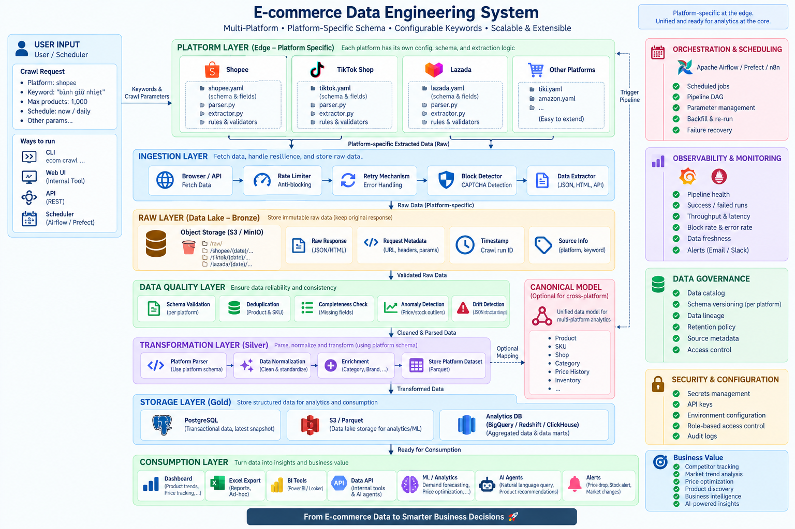

# Architecture overview (as implemented)



The target architecture is described in [`SYSTEM_SPEC.md`](SYSTEM_SPEC.md). This
page maps the specification to what exists in the code today. The rule that
shapes everything:

> **Specific at the edge. Unified at the core. Independent at consumption.**

## Layers

| Spec layer | Status | Implementation |
|---|---|---|
| User input | done | `ecommerce` CLI (`src/ecommerce/cli.py`). `CrawlRequest` in `settings.py` carries platform, keyword, domain, max_products. Keyword is never in YAML. |
| Platform edge | done | `platforms/base.py::PlatformAdapter` (crawl, check_session, build_dataset, candidate_model) + registry in `platforms/__init__.py`. Shopee and TikTok Shop adapters. Each platform: `configs/platforms/<name>/config.yaml`, `extract/`, `parse/`, contract rules in `contracts/<name>.py`. |
| Ingestion | done | `ingestion/browser.py`: real Chrome/Edge in attach mode, response tap, block/captcha/login-wall detection, human pauses. Pacing/cooldown/retry in each platform's `extract/`. `ingestion/images.py` thumbnail cache. |
| Bronze / raw | done | `ingestion/raw_store.py::RunStore`. `data/raw/<platform>/<yyyymmdd[_n]>/` with `run.json` (keyword, domain, versions, created_at), `search/`, `items/`, `candidates.json`, `failures.json`. Atomic writes, never overwritten. Backward compatible with runs made before `run.json` existed. |
| Data quality | partial | Schema validation = data contracts (`contracts/`): `SchemaGuard` pauses a crawl after N consecutive broken files; `check-schema` compares a run with a baseline and reports coverage drops and renamed fields. Deduplication of candidates by platform id. Validity = Pydantic constraints on `Product` (price ≥ 0, rating 0..5, discount 0..100). Completeness = checklist coverage sheet. **Not implemented:** anomaly detection, quality metrics store. |
| Silver / transformation | done | `platforms/<name>/parse/`: raw JSON → `domain/product.py::Product` (typed, validated). `transformation/filters.py` + `transformation/specs/` driven by the domain profile (`domain/profile.py`, `configs/domains/<name>.yaml`). Output = ranked platform dataset (`domain/dataset.py::Dataset`). |
| Canonical model | not started | `Product` is already platform-agnostic in shape (both parsers fill it), which is the seed of a canonical model, but there is no separate canonical store or mapping step. |
| Gold / storage | not started | Today the platform dataset lives in memory between `build_dataset` and the Excel writer. See roadmap. |
| Historical data | partial | Every crawl is a dated, immutable run under `data/raw/`; history exists as raw snapshots, not as a queryable price/stock timeline. |
| Consumption | done (Excel) | `consumption/excel/`: layout in `configs/reports/<name>.yaml` (sheets, order, columns, per-platform styling), column registry and value computation in Python. Dashboard / BI / API / ML / agents: see roadmap. |
| Orchestration | not started | Commands are resumable and idempotent per run (files on disk are the checkpoint), which is what a DAG needs; no scheduler yet. |
| Observability | partial | `status` prints per-run counters (pages, candidates, crawled, per-SKU stock, failures); structured logs. No metrics store or alerts. |
| Governance | partial | `run.json` records keyword, domain, raw schema version and package version; contract baselines are versioned in git. No catalog / lineage store. |
| Security | done for scope | No secrets in code. Browser sessions live in local profile folders that are git-ignored. `ECOMMERCE_*` env vars for machine-specific overrides. |

## Data flow

```
CrawlRequest(platform, keyword, domain, max_products)
        │
        ▼
PlatformAdapter.crawl(context, store, cfg)
   discovery  ──► store.search_path(n)       (raw search / keyword pages)
   candidates ──► store.candidates_path      (kept / excluded, with reasons)
   detail     ──► store.item_path(a, b)      (raw product JSON + candidate + scraped_at)
   failures   ──► store.failures_path
   metadata   ──► store.meta_path            (run.json)
        │
        ▼   (any time later, no browser)
PlatformAdapter.build_dataset(store, cfg)
   parse_product(raw, profile)  → Product        (typed, validated)
   keep_product(title, profile) → filter          (domain profile)
   rank(...)                    → Dataset         (top N, excluded, failures, meta)
        │
        ▼
write_report(dataset, export, layout, prefix)  → output/<platform>/<file>.xlsx
```

## Configuration model

| File | Owner | Changes when |
|---|---|---|
| `configs/app.yaml` | operator | timeouts, export size, default platform / domain |
| `configs/platforms/<name>/config.yaml` | platform | the site's behaviour changes (pacing, pages, browser) |
| `configs/domains/<name>.yaml` | analyst | a new product category is crawled |
| `configs/reports/<name>.yaml` | consumer | the Excel deliverable changes shape |
| `--keyword` | user | every run |

Every file is validated by a Pydantic model (`settings.py`, `domain/profile.py`,
`consumption/excel/layout.py`) with `extra="forbid"`, so typos fail at start-up.

## Definition of done — status

| # | Criterion (spec §21) | Status |
|---|---|---|
| 1 | New crawl by changing keyword/config, not Python | ✅ `--keyword`, `--domain`, YAML |
| 2 | Each platform keeps its own schema and extraction logic | ✅ `platforms/<name>/` + `contracts/<name>.py` |
| 3 | A platform schema change does not break other platforms | ✅ parsers and contracts are per platform; tests per platform |
| 4 | Raw responses can be replayed without crawling | ✅ `export` reads `data/raw/` only |
| 5 | Data quality failures are detectable and traceable | ◐ contracts + guard + failures.json; no metrics store |
| 6 | Historical states preserved | ◐ immutable dated runs; no timeline table |
| 7 | Excel layout changes independently from ingestion | ✅ `configs/reports/*.yaml` |
| 8 | New platform without rewriting the core | ✅ adapter + registry |
| 9 | Installable Python package | ✅ `pip install -e .`, `python -m build`, configs bundled |
| 10 | Same processed data serves Excel, BI, API, ML, AI | ◐ `Dataset` is the single source for consumers; only Excel exists |
